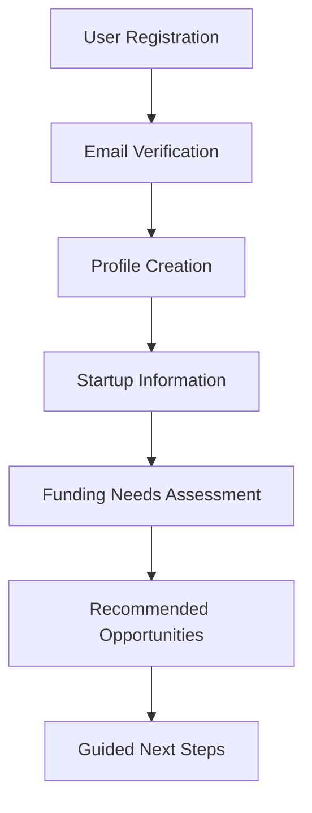
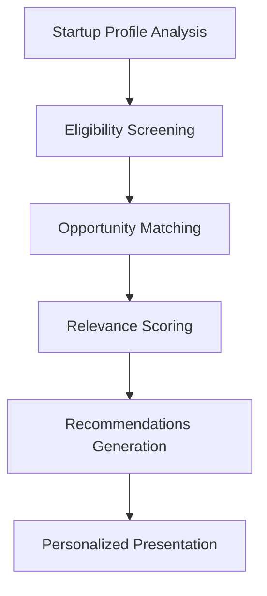
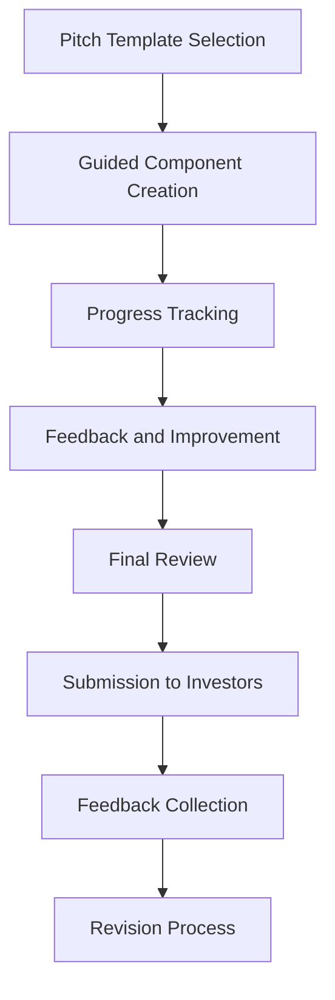
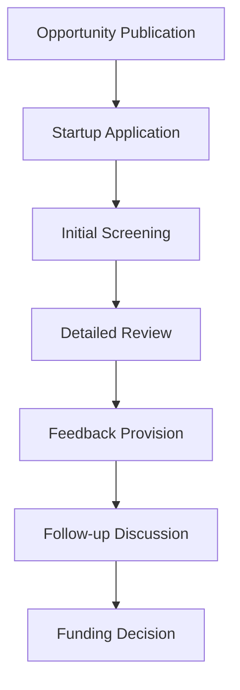

# Business Logic

This document outlines the core business logic, rules, and operational workflows behind the Dutch Funding Opportunities platform.

## Overview

The Dutch Funding Opportunities platform connects startup founders with relevant funding sources in the Netherlands. The business logic is built around matching startups with appropriate funding options based on their profile, stage, and needs, while guiding founders through the process of preparing for funding applications.

## Core Business Domains

### 1. User Management

#### User Types
- **Founders**: Startup entrepreneurs seeking funding
- **Investors**: Entities providing funding opportunities
- **Administrators**: System managers with elevated privileges

#### User Lifecycle
1. **Registration**: Users create accounts with basic information
2. **Profile Completion**: Users fill out detailed profiles
3. **Account Management**: Users can update profiles, change settings
4. **Progress Tracking**: System tracks user engagement with the platform

### 2. Startup Profile Management

#### Startup Information Model
- Basic Information (name, description, website)
- Industry/Sector Classification
- Development Stage
- Team Information
- Financial Information
- Growth Metrics

#### Validation Rules
- Startups must have a name and description
- Industry/sector must be selected from predefined options
- Development stage must be identified
- Financial information format is validated when provided

### 3. Funding Opportunity Matching

#### Matching Algorithm
The core matching logic evaluates compatibility between startups and funding sources based on:

- Startup development stage ↔ Investor preferred stages
- Industry/sector alignment
- Funding amount requirements
- Geographic considerations
- Application deadlines
- Special eligibility criteria

#### Relevance Scoring
Each potential match receives a relevance score (0-100) calculated as:
```
relevance_score = (
  (stage_match * 0.30) +
  (sector_match * 0.25) +
  (amount_match * 0.20) +
  (location_match * 0.15) +
  (criteria_match * 0.10)
) * 100
```

#### Filtering Logic
Users can filter funding opportunities by:
- Opportunity type (grants, loans, equity, etc.)
- Funding amount range
- Application deadline
- Focus industries
- Geographic restrictions

### 4. Pitch Development System

#### Pitch Components
The system guides users through creating comprehensive pitches with these components:
- Elevator pitch (30-second overview)
- Problem statement
- Solution description
- Target market analysis
- Business model
- Competitor analysis
- Team qualifications
- Traction and milestones
- Financial projections
- Funding request and use of funds

#### Progress Tracking
The system tracks completion of each pitch component and provides:
- Progress indicators
- Quality assessments
- Recommendations for improvement
- Examples of successful pitches

#### Submission Workflow
1. User develops pitch components
2. System validates completeness
3. User submits pitch for review
4. System notifies relevant investors
5. Investors can provide feedback
6. User can revise and resubmit

### 5. Achievement and Gamification System

#### Achievement Types
- Profile completion milestones
- Pitch development progress
- Funding application submissions
- Investor connections established
- Educational content completion

#### Rewards System
- Achievement badges
- Progress visualizations
- Unlocked features
- Personalized recommendations

#### Engagement Rules
- Achievements are automatically awarded when criteria are met
- Points accumulate based on platform engagement
- Milestones trigger motivational messaging
- Progress decay occurs after periods of inactivity

## Business Processes

### 1. User Onboarding Flow



### 2. Funding Match Process



### 3. Pitch Development Cycle



### 4. Investor Engagement Flow



## Business Rules and Constraints

### Eligibility Rules

1. **Startup Stage Matching**
   - Early-stage startups (pre-seed, seed) match with:
     - Government grants
     - Angel investors
     - Incubator programs
     - Early-stage VCs
   - Growth-stage startups match with:
     - Series A/B investors
     - Scale-up programs
     - Larger grants and subsidies

2. **Sector-Specific Matching**
   - Tech startups qualify for innovation grants (WBSO, Innovation Credit)
   - Impact startups qualify for social enterprise funding
   - Industry-specific opportunities require exact or related sector match

3. **Location Requirements**
   - Some opportunities require Dutch registration
   - Regional programs may require presence in specific provinces
   - EU programs typically require EU incorporation

### Application Rules

1. **Deadline Management**
   - Opportunities with approaching deadlines are highlighted
   - Closed opportunities are marked but remain visible for reference
   - Rolling applications are flagged as "always open"

2. **Document Requirements**
   - Each opportunity lists required documentation
   - System tracks document preparation status
   - Templates are provided where applicable

3. **Submission Validation**
   - All required fields must be completed
   - Attachments must meet size and format requirements
   - Contact information must be verified

### Privacy and Data Handling

1. **Data Visibility Controls**
   - Founders control visibility of sensitive business information
   - Investors only see submitted pitches and approved information
   - Administrators have full access for support purposes

2. **Communication Protocols**
   - Initial communication happens through the platform
   - Direct contact information is shared only after mutual agreement
   - All parties must agree to confidentiality terms

## Integration Points

### External Systems Integration

1. **Government Databases**
   - RVO (Netherlands Enterprise Agency) grant information
   - KVK (Chamber of Commerce) business verification
   - EU funding databases

2. **Financial Systems**
   - Banking verification (for payment processing)
   - Financial projection tools
   - Accounting system connections

3. **CRM and Marketing**
   - Email notification system
   - Event management integration
   - Follow-up scheduling

## Decision Tables

### Funding Type Recommendation

| Startup Stage | Revenue | Team Size | Intellectual Property | Primary Recommendation | Secondary Recommendation |
|---------------|---------|-----------|----------------------|------------------------|--------------------------|
| Idea/Concept  | None    | 1-2       | Limited              | Grants/Subsidies       | Angel Investment         |
| Idea/Concept  | None    | 3+        | Strong               | Accelerator Programs   | Pre-seed VC              |
| MVP           | None    | 1-3       | Limited              | Grants/Subsidies       | Accelerator Programs     |
| MVP           | None    | 3+        | Strong               | Seed VC                | Angel Investment         |
| MVP           | <€100K  | Any       | Any                  | Seed VC                | Revenue-based Financing  |
| Market Entry  | <€250K  | Any       | Any                  | Series A VC            | Venture Debt             |
| Growth        | €250K+  | Any       | Any                  | Series A/B VC          | Bank Loans               |
| Scale-up      | €1M+    | Any       | Any                  | Series B/C VC          | Private Equity           |

### Grant Eligibility Quick Check

| R&D Focus | Dutch Entity | Team Size | Operating History | WBSO | Innovation Credit | MIT Feasibility | EU EIC Accelerator |
|-----------|--------------|-----------|-------------------|------|------------------|-----------------|-------------------|
| High      | Yes          | Any       | Any               | ✓    | ✓                | ✓               | ✓                 |
| High      | No           | Any       | Any               | ✗    | ✗                | ✗               | ✓                 |
| Medium    | Yes          | <10       | <3 years          | ✓    | ✓                | ✓               | ✗                 |
| Medium    | Yes          | <10       | 3+ years          | ✓    | ✓                | ✗               | ✗                 |
| Medium    | Yes          | 10+       | Any               | ✓    | ✓                | ✗               | ✓                 |
| Low       | Yes          | Any       | Any               | ✗    | ✗                | ✗               | ✗                 |

## Operational Workflows

### Funding Application Preparation

1. **Opportunity Selection**
   - User reviews matched opportunities
   - User selects target opportunity for application

2. **Requirements Analysis**
   - System displays all application requirements
   - Checklist of required documents is generated
   - Timeline for preparation is suggested

3. **Document Preparation**
   - Templates are provided where available
   - Progress tracking for document completion
   - Document storage and organization

4. **Submission Guidance**
   - Step-by-step application instructions
   - Common mistakes and how to avoid them
   - Submission deadline reminders
   - Confirmation of submission

5. **Follow-up Process**
   - Expected response timeline
   - Follow-up reminders
   - Status tracking

## Conclusion

The business logic of the Dutch Funding Opportunities platform is designed to create an efficient, transparent, and supportive ecosystem for connecting startups with appropriate funding sources. By implementing these rules, processes, and workflows, the platform aims to simplify the funding journey for Dutch startup founders while providing valuable data-driven insights to help them succeed. 