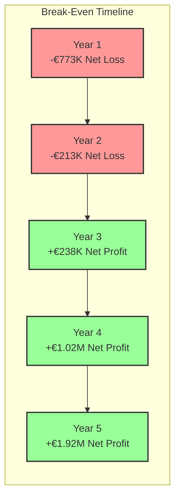

# Business Model

## Executive Summary

The Dutch Funding Opportunities platform presents a sustainable business model centered on connecting Dutch startups with relevant funding sources. The platform addresses significant market inefficiencies in the funding discovery and application process, creating value for both startup founders and funding providers. This document outlines the comprehensive business model, including revenue streams, cost structure, value propositions, and financial projections.

## Business Model Canvas

### Value Propositions

#### For Startup Founders

1. **Funding Discovery Efficiency**
   - 80% reduction in funding research time
   - Comprehensive database of 300+ Dutch funding opportunities
   - Personalized matching based on startup profile
   - Up-to-date information on deadlines and eligibility

2. **Application Optimization**
   - Guided pitch development process
   - Application requirement clarity
   - Templates and best practices
   - Feedback mechanisms for improvement

3. **Knowledge Building**
   - Educational content on funding types
   - Context-specific guidance
   - Process transparency
   - Success metrics and benchmarking

#### For Investors & Funding Providers

1. **Deal Flow Quality**
   - Pre-qualified startup applications
   - Standardized pitch formats
   - Matching based on investment criteria
   - Efficient filtering and discovery

2. **Process Efficiency**
   - Structured application review
   - Standardized information formats
   - Time savings in screening
   - Streamlined communication

3. **Market Insights**
   - Trend analysis in startup sectors
   - Competitive landscape visibility
   - Startup ecosystem metrics
   - Quality benchmark data

### Customer Segments

#### Primary Segments

1. **Early-Stage Startups** (Pre-seed to Seed)
   - First-time founders seeking initial funding
   - Technical founders with limited business experience
   - Startups with MVP seeking market validation funding
   - University spin-offs and research commercialization

2. **Growth-Stage Startups** (Series A/B)
   - Established startups seeking scale-up funding
   - Companies with proven business models
   - International expansion-focused ventures
   - Second-time founders with previous exits

3. **Impact/Social Enterprises**
   - Mission-driven ventures
   - Sustainability-focused startups
   - Social innovation companies
   - Circular economy businesses

#### Secondary Segments

1. **Investors**
   - Angel investors
   - Venture capital firms
   - Corporate venture arms
   - Impact investors

2. **Grant Administrators**
   - Government funding agencies
   - Private foundation grant managers
   - EU program administrators
   - Research funding organizations

3. **Ecosystem Partners**
   - Accelerators and incubators
   - University entrepreneurship centers
   - Startup support organizations
   - Co-working spaces and innovation hubs

### Revenue Streams

#### Primary Revenue Streams

1. **Subscription Model**

| Tier | Target Audience | Monthly Price | Annual Price | Key Features |
|------|----------------|--------------|-------------|-------------|
| Basic | Early-stage startups | Free | Free | Limited recommendations, basic profile, educational content |
| Standard | Early/Growth startups | €49/month | €499/year | Unlimited recommendations, full pitch tools, priority support |
| Premium | Growth-stage startups | €99/month | €999/year | Advanced features, customized recommendations, expert review |
| Enterprise | Accelerators/Incubators | Custom | Custom | White-label, bulk accounts, API access, custom integrations |

2. **Investor Subscriptions**

| Tier | Target Audience | Monthly Price | Annual Price | Key Features |
|------|----------------|--------------|-------------|-------------|
| Investor Basic | Angel investors | €49/month | €499/year | Startup discovery, basic filtering, pitch review |
| Investor Pro | VCs, Investment firms | €199/month | €1,999/year | Advanced filters, portfolio tracking, trend analysis |
| Investor Enterprise | Multiple users/firms | Custom | Custom | Team accounts, API access, custom integrations |

#### Secondary Revenue Streams

1. **Premium Services**
   - Pitch review by experts (€199-€399 per review)
   - Application support packages (€499-€999)
   - One-on-one coaching sessions (€150-€300 per hour)
   - Custom research reports (€1,500-€5,000)

2. **Optional Success Fee Model**
   - Alternative to subscription for early-stage startups
   - 1% of successfully raised funding amount
   - Capped at €10,000 per funding round
   - Minimum fee of €500 per successful funding

3. **Marketplace Commissions**
   - 10-15% commission on service provider bookings
   - Featured listings for funding opportunities (€199-€499)
   - Sponsored content placements (€299-€999)
   - Event promotions (€199-€599)

4. **Data & Insights**
   - Anonymized trend reports for corporates (€1,999-€4,999)
   - Ecosystem analysis for government agencies (€3,999-€9,999)
   - Custom research projects (€5,000+)
   - API access for third-party developers (usage-based pricing)

### Customer Relationships

1. **Acquisition Channels**
   - Content marketing (blog, guides, resources)
   - Partnerships with startup hubs & coworking spaces
   - Digital marketing (SEO, SEM, social media)
   - Event sponsorship and workshops
   - Referral programs

2. **Onboarding & Activation**
   - Interactive guided onboarding
   - Freemium entry with clear value demonstration
   - Achievement-based progression
   - Early-win focus (quick value realization)

3. **Retention Strategies**
   - Regular feature enhancements
   - Personalized content and recommendations
   - Community building activities
   - Success celebration and showcasing
   - Regular check-ins and support

4. **Customer Success**
   - Dedicated support for premium tiers
   - Training webinars and materials
   - Usage analytics with recommendations
   - Account reviews and optimization

### Key Activities

1. **Platform Development & Maintenance**
   - Continuous product development
   - Technical infrastructure management
   - UX/UI refinement
   - Mobile responsiveness

2. **Content Creation & Curation**
   - Funding opportunity database management
   - Educational content development
   - Template creation and improvement
   - Success stories documentation

3. **Algorithm Enhancement**
   - Matching algorithm refinement
   - Recommendation engine optimization
   - Machine learning model training
   - Data analysis and insight generation

4. **Partnership Management**
   - Investor relationship development
   - Ecosystem partner engagement
   - Integration partner collaboration
   - Government relations

5. **Marketing & Growth**
   - Brand awareness campaigns
   - User acquisition initiatives
   - Engagement optimization
   - Conversion rate improvement

### Key Resources

1. **Human Capital**
   - Technical development team
   - Product management expertise
   - Funding domain specialists
   - User experience designers
   - Content creators
   - Business development professionals

2. **Technological Infrastructure**
   - Cloud hosting and services
   - Database architecture
   - Development frameworks
   - Security systems
   - Analytics platform

3. **Intellectual Property**
   - Matching algorithm
   - Database structure and content
   - Brand assets and identity
   - Educational content
   - User experience design

4. **Financial Resources**
   - Initial development capital
   - Operational runway
   - Marketing budget
   - Growth investment

### Key Partnerships

1. **Content & Data Partners**
   - Government funding agencies
   - Industry associations
   - Research institutions
   - Financial data providers

2. **Channel Partners**
   - Accelerators and incubators
   - Co-working spaces
   - University entrepreneurship programs
   - Accounting and consulting firms

3. **Technology Partners**
   - Payment processors
   - CRM integration providers
   - Analytics platforms
   - Communication tools

4. **Strategic Alliances**
   - Government innovation agencies
   - Startup ecosystem organizations
   - International expansion partners
   - Complementary service providers

### Cost Structure

#### Initial Development Costs (Year 1)

| Category | Description | Estimated Cost (€) |
|----------|-------------|-------------------|
| Technical Development | Platform development, infrastructure setup | 175,000 |
| Content Creation | Funding database population, educational content | 65,000 |
| Design | UX/UI design, brand identity | 45,000 |
| Marketing | Initial marketing materials, website, launch | 40,000 |
| Legal & Administrative | Company setup, contracts, terms of service | 25,000 |
| **Total Initial Investment** | | **350,000** |

#### Operational Costs (Annual)

| Category | Description | Year 1 (€) | Year 2 (€) | Year 3 (€) |
|----------|-------------|------------|------------|------------|
| Personnel | Development, content, marketing, support, management | 420,000 | 580,000 | 820,000 |
| Technology | Hosting, services, software subscriptions | 36,000 | 48,000 | 72,000 |
| Marketing | Ongoing campaigns, content, events | 60,000 | 120,000 | 180,000 |
| Office & Admin | Workspace, equipment, administrative costs | 48,000 | 60,000 | 84,000 |
| Legal & Professional | Legal, accounting, consulting services | 24,000 | 30,000 | 36,000 |
| **Total Annual Operational Costs** | | **588,000** | **838,000** | **1,192,000** |

### Financial Projections

#### 5-Year Revenue Forecast

| Revenue Stream | Year 1 (€) | Year 2 (€) | Year 3 (€) | Year 4 (€) | Year 5 (€) |
|----------------|------------|------------|------------|------------|------------|
| Startup Subscriptions | 120,000 | 380,000 | 780,000 | 1,400,000 | 2,200,000 |
| Investor Subscriptions | 40,000 | 150,000 | 320,000 | 550,000 | 850,000 |
| Premium Services | 30,000 | 90,000 | 210,000 | 350,000 | 480,000 |
| Success Fees | 15,000 | 60,000 | 160,000 | 280,000 | 420,000 |
| Marketplace Revenue | 0 | 35,000 | 120,000 | 250,000 | 400,000 |
| Data & Insights | 0 | 20,000 | 80,000 | 170,000 | 300,000 |
| **Total Revenue** | **205,000** | **735,000** | **1,670,000** | **3,000,000** | **4,650,000** |

#### 5-Year Profit & Loss Summary

| Category | Year 1 (€) | Year 2 (€) | Year 3 (€) | Year 4 (€) | Year 5 (€) |
|----------|------------|------------|------------|------------|------------|
| Total Revenue | 205,000 | 735,000 | 1,670,000 | 3,000,000 | 4,650,000 |
| Cost of Revenue | 40,000 | 110,000 | 240,000 | 390,000 | 580,000 |
| Gross Profit | 165,000 | 625,000 | 1,430,000 | 2,610,000 | 4,070,000 |
| Gross Margin | 80.5% | 85% | 85.6% | 87% | 87.5% |
| Operating Expenses | 588,000 | 838,000 | 1,192,000 | 1,590,000 | 2,150,000 |
| EBITDA | -423,000 | -213,000 | 238,000 | 1,020,000 | 1,920,000 |
| EBITDA Margin | -206% | -29% | 14.3% | 34% | 41.3% |
| Initial Investment | 350,000 | 0 | 0 | 0 | 0 |
| **Net Profit/Loss** | **-773,000** | **-213,000** | **238,000** | **1,020,000** | **1,920,000** |

#### Key Metrics Forecast

| Metric | Year 1 | Year 2 | Year 3 | Year 4 | Year 5 |
|--------|--------|--------|--------|--------|--------|
| Registered Users (Startups) | 1,000 | 2,800 | 6,000 | 11,000 | 18,000 |
| Paying Startup Subscribers | 200 | 680 | 1,650 | 3,100 | 5,200 |
| Conversion Rate | 20% | 24% | 27.5% | 28% | 29% |
| Registered Investors | 50 | 180 | 400 | 750 | 1,200 |
| Paying Investor Subscribers | 15 | 70 | 180 | 340 | 580 |
| Average Revenue Per User (ARPU) | €505 | €625 | €740 | €800 | €825 |
| Customer Acquisition Cost (CAC) | €280 | €240 | €200 | €185 | €175 |
| Customer Lifetime Value (LTV) | €1,010 | €1,400 | €1,850 | €2,400 | €2,890 |
| LTV:CAC Ratio | 3.6:1 | 5.8:1 | 9.3:1 | 13:1 | 16.5:1 |

### Break-Even Analysis

Based on the financial projections, the platform is expected to:
- Reach monthly cash flow break-even in Month 26 (Year 3)
- Achieve cumulative break-even (recouping initial investment) in Month 38 (Year 4)
- Generate first annual profit in Year 3

### Funding Requirements

To execute the business plan, the following funding is required:

1. **Seed Funding**: €500,000
   - Purpose: Cover initial development costs and first 6 months of operations
   - Timing: Immediate
   - Use of funds: Platform development, team building, initial marketing

2. **Series A**: €1,500,000
   - Purpose: Scale operations and reach profitability
   - Timing: Month 12-18
   - Use of funds: Team expansion, marketing growth, feature development

### Investment Returns

Potential returns for investors based on projected company valuation:

| Funding Round | Amount (€) | Equity Offered | Valuation | Exit Valuation (Year 5) | Potential Return | ROI |
|---------------|------------|----------------|-----------|-------------------------|-----------------|-----|
| Seed | 500,000 | 20% | 2.5M | 25M | 5M | 10x |
| Series A | 1.5M | 25% | 6M | 25M | 6.25M | 4.17x |

## Growth Strategy

### Market Penetration

**Year 1-2: Dutch Focus**
- Concentrate on Dutch startup ecosystem
- Build comprehensive local funding database
- Establish strong local partnerships
- Achieve market presence in major startup hubs

**Year 3-4: Benelux Expansion**
- Expand to Belgium and Luxembourg
- Adapt platform for additional markets
- Leverage Dutch success stories
- Establish regional partnerships

**Year 5+: European Expansion**
- Selective expansion to key European markets
- Focus on markets with similar funding landscapes
- Develop localized versions
- Build European-wide investor network

### Product Evolution

**Phase 1: Core Platform**
- Funding database and matchmaking
- Basic pitch development tools
- Standard startup profiles
- Simple investor interfaces

**Phase 2: Feature Enhancement**
- Advanced matching algorithm
- Comprehensive pitch tools
- Achievement system
- Detailed analytics

**Phase 3: Ecosystem Development**
- API and integration capabilities
- Marketplace for services
- Advanced investor tools
- Community features

**Phase 4: Intelligence Layer**
- Predictive analytics
- Machine learning recommendations
- Automated application assistance
- Market intelligence reports

## Exit Strategy

### Potential Exit Scenarios

1. **Strategic Acquisition** (Most Likely)
   - Potential acquirers: Financial information providers, enterprise software companies, startup ecosystem players
   - Estimated timeframe: 5-7 years
   - Valuation basis: 5-7x annual recurring revenue
   - Estimated valuation range: €20-35 million

2. **IPO/Public Listing** (Less Likely)
   - Potential market: Euronext Growth
   - Requirements: €10M+ annual revenue, consistent growth
   - Estimated timeframe: 8-10 years
   - Valuation basis: 8-12x annual revenue
   - Estimated valuation range: €40-60 million

3. **Private Equity Investment** (Alternative)
   - Scenario: Majority stake acquisition by PE firm
   - Estimated timeframe: 5-8 years
   - Requirements: Profitable operations, strong growth
   - Potential for founder/management retention
   - Valuation basis: 6-8x EBITDA
   - Estimated valuation range: €15-25 million

## Risk Analysis

### Business Model Risks

| Risk Category | Specific Risk | Probability | Impact | Mitigation Strategy |
|---------------|---------------|------------|--------|---------------------|
| Revenue | Low conversion rate to paid tiers | Medium | High | Robust freemium value, clear upgrade benefits, conversion optimization |
| Revenue | Pricing resistance | Medium | Medium | Value-based pricing, ROI demonstration, tiered approach |
| Costs | Development cost overruns | Medium | Medium | Phased approach, careful scope management, agile methodology |
| Market | Limited market size | Low | Medium | Expansion to adjacent services, international growth plan |
| Market | Competitor entry | Medium | High | First-mover advantage, network effects, deep integration |
| Operational | Data quality issues | Medium | High | Verification processes, user feedback loops, regular audits |
| Operational | Key person dependency | Medium | High | Knowledge distribution, documentation, backup roles |

### Mitigation Strategies

1. **Revenue Diversification**
   - Multiple revenue streams reduce dependency
   - Tiered pricing creates options for different users
   - Value-based services complement subscription model

2. **Cost Control**
   - Phased development to manage cash flow
   - Cloud infrastructure for scalable costs
   - Remote-first approach to reduce office expenses
   - Performance-based compensation elements

3. **Market Position Defense**
   - Strong local partnerships creating barriers to entry
   - Proprietary database and algorithm development
   - Community building for loyalty and retention
   - Continuous innovation roadmap

## Sustainability Assessments

### Financial Sustainability

The business model demonstrates financial sustainability through:
- Recurring revenue from subscriptions (80%+ of revenue)
- High gross margins (85%+)
- Improving EBITDA margins over time
- Reasonable customer acquisition costs
- Strong LTV:CAC ratio (9:1+ by Year 3)
- Multiple complementary revenue streams

### Market Sustainability

The model is supported by sustainable market conditions:
- Growing Dutch startup ecosystem
- Increasing venture capital availability
- Government support for innovation
- Continuing complexity in funding landscape
- Unmet need for funding navigation

### Operational Sustainability

The operations are designed for long-term sustainability through:
- Scalable cloud infrastructure
- Automation of key processes
- Efficient team structure
- Data-driven decision making
- Continuous improvement methodology

## Conclusion

The Dutch Funding Opportunities platform presents a sustainable and scalable business model addressing significant pain points in the startup funding ecosystem. By connecting startups with appropriate funding sources through an intelligent matching platform, the business creates value for all stakeholders while generating multiple revenue streams.

The financial projections demonstrate a path to profitability by Year 3, with strong growth potential in subsequent years. The phased approach to development and market expansion balances ambitious goals with prudent resource management.

This business model provides a solid foundation for initial investment, with clear milestones for future funding rounds and a credible path to investor returns through multiple potential exit scenarios. 