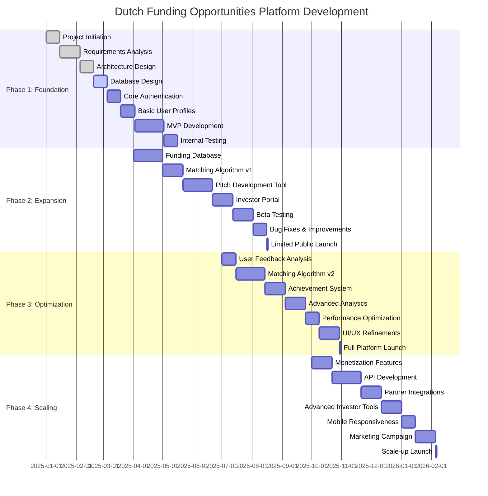
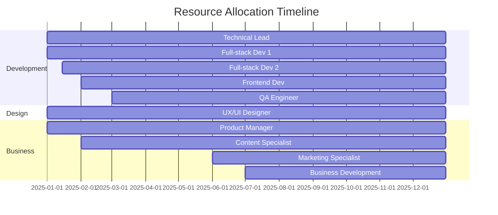

# Project Roadmap

## Overview

This document outlines the strategic roadmap for the development and launch of the Dutch Funding Opportunities platform. The roadmap is organized into phases with clear milestones, deliverables, and timelines to guide the project execution and track progress.

## Strategic Goals

1. **Market Entry**: Establish the platform as a valuable resource for Dutch startups seeking funding
2. **User Adoption**: Achieve critical mass of users (both founders and investors)
3. **Platform Value**: Deliver measurable value in funding success rates
4. **Sustainable Operation**: Build a sustainable business model with clear revenue streams
5. **Ecosystem Impact**: Become an integral part of the Dutch startup ecosystem

## Phased Approach

The platform development follows a phased approach to manage complexity, validate assumptions, and deliver value incrementally:

### Phase 1: Foundation (Months 1-3)

Focus on establishing the core technical infrastructure and minimum viable product (MVP) features.

### Phase 2: Expansion (Months 4-6)

Enhance the platform with additional features based on initial user feedback and increase market penetration.

### Phase 3: Optimization (Months 7-9)

Refine the platform based on usage data, improve matching algorithms, and introduce advanced features.

### Phase 4: Scaling (Months 10-12)

Focus on growth, monetization strategies, and expansion of partnerships and integrations.

## Detailed Project Timeline

## Phase 1: Foundation (Months 1-3)

### Goals

- Establish technical infrastructure
- Develop core authentication and user management
- Create basic startup profile management
- Build simple funding opportunity database
- Complete internal testing

### Milestones

| Milestone | Description | Timeline | Status |
|-----------|-------------|----------|--------|
| M1.1 | Project kickoff and team onboarding | Week 1 | Complete |
| M1.2 | Requirements documentation approved | Week 3 | Complete |
| M1.3 | Technical architecture defined | Week 5 | Complete |
| M1.4 | Database schema implemented | Week 7 | In Progress |
| M1.5 | User authentication system working | Week 9 | Not Started |
| M1.6 | Basic user profiles functional | Week 11 | Not Started |
| M1.7 | MVP features implemented | Week 15 | Not Started |
| M1.8 | Internal testing completed | Week 17 | Not Started |

### Key Deliverables

1. **Technical Infrastructure**
   - Supabase project setup
   - Next.js application scaffold
   - CI/CD pipelines
   - Development, staging, and production environments

2. **Core User Management**
   - User registration and authentication
   - Email verification
   - Password reset functionality
   - User profile basics

3. **Startup Profile Management**
   - Create/edit startup information
   - Basic classification (stage, industry, etc.)
   - Simple profile completeness tracking

4. **Funding Database Foundation**
   - Initial database of Dutch funding opportunities
   - Basic categorization system
   - Simple search functionality

### Dependencies

- Technical team recruitment completed
- Supabase account and services established
- Initial funding opportunity data collected

## Phase 2: Expansion (Months 4-6)

### Goals

- Expand the funding opportunity database
- Implement initial matching algorithm
- Develop pitch creation tools
- Create investor-facing features
- Conduct beta testing with selected users

### Milestones

| Milestone | Description | Timeline | Status |
|-----------|-------------|----------|--------|
| M2.1 | Comprehensive funding database | Week 21 | Not Started |
| M2.2 | Matching algorithm v1 implemented | Week 24 | Not Started |
| M2.3 | Pitch development tool launched | Week 28 | Not Started |
| M2.4 | Investor portal completed | Week 31 | Not Started |
| M2.5 | Beta testing program started | Week 34 | Not Started |
| M2.6 | Bug fixes & improvements completed | Week 36 | Not Started |
| M2.7 | Limited public launch | Week 37 | Not Started |

### Key Deliverables

1. **Expanded Funding Database**
   - 200+ Dutch funding opportunities documented
   - Detailed eligibility criteria
   - Advanced filtering and search
   - Regular update mechanisms

2. **Matching Algorithm v1**
   - Startup-to-opportunity matching based on key criteria
   - Relevance scoring system
   - Personalized recommendations
   - Initial explanation system

3. **Pitch Development Tool**
   - Component-based pitch creation
   - Templates and examples
   - Progress tracking
   - Basic feedback mechanisms

4. **Investor Portal**
   - Investor profiles
   - Startup discovery features
   - Pitch review interface
   - Communication channel

5. **Beta Program**
   - 50-100 selected startup users
   - 10-15 investor participants
   - Structured feedback collection
   - Regular engagement touchpoints

### Dependencies

- Funding data research completed
- Initial algorithm design validated
- Beta user recruitment successful
- Feedback collection system in place

## Phase 3: Optimization (Months 7-9)

### Goals

- Analyze and implement user feedback
- Enhance matching algorithm
- Develop achievement and gamification system
- Build analytics capabilities
- Optimize performance and user experience
- Launch full platform to public

### Milestones

| Milestone | Description | Timeline | Status |
|-----------|-------------|----------|--------|
| M3.1 | User feedback analysis completed | Week 41 | Not Started |
| M3.2 | Matching algorithm v2 launched | Week 45 | Not Started |
| M3.3 | Achievement system implemented | Week 48 | Not Started |
| M3.4 | Analytics dashboard working | Week 51 | Not Started |
| M3.5 | Performance optimization completed | Week 53 | Not Started |
| M3.6 | UI/UX refinements implemented | Week 56 | Not Started |
| M3.7 | Full platform launch | Week 57 | Not Started |

### Key Deliverables

1. **User Feedback Implementation**
   - Prioritized enhancement list
   - User-requested feature implementation
   - Usability improvements
   - Pain point resolutions

2. **Enhanced Matching Algorithm**
   - Machine learning components
   - Behavioral data incorporation
   - Improved relevance scoring
   - Comprehensive match explanations

3. **Achievement System**
   - Progress tracking mechanisms
   - Badge and reward system
   - Milestone celebrations
   - Personalized challenges

4. **Analytics Capabilities**
   - User behavior analytics
   - Platform usage metrics
   - Success rate tracking
   - Admin dashboard

5. **Performance & UX Optimization**
   - Speed improvements
   - Responsive design enhancements
   - Accessibility compliance
   - Cross-browser compatibility

### Dependencies

- Sufficient user feedback collected
- Data available for algorithm training
- Achievement system design approved
- Analytics requirements defined

## Phase 4: Scaling (Months 10-12)

### Goals

- Implement monetization features
- Develop API for integrations
- Create partnerships with ecosystem players
- Enhance tools for advanced users
- Optimize for mobile
- Launch marketing campaign
- Prepare for scale

### Milestones

| Milestone | Description | Timeline | Status |
|-----------|-------------|----------|--------|
| M4.1 | Monetization features implemented | Week 61 | Not Started |
| M4.2 | API documentation and development | Week 65 | Not Started |
| M4.3 | Partner integrations established | Week 68 | Not Started |
| M4.4 | Advanced investor tools launched | Week 71 | Not Started |
| M4.5 | Mobile responsiveness optimized | Week 73 | Not Started |
| M4.6 | Marketing campaign executed | Week 76 | Not Started |
| M4.7 | Scale-up launch completed | Week 77 | Not Started |

### Key Deliverables

1. **Monetization Features**
   - Subscription plan implementation
   - Payment processing integration
   - Account management for paid features
   - Billing system

2. **API Development**
   - RESTful API design
   - Authentication & authorization
   - Rate limiting
   - Documentation portal

3. **Partner Integrations**
   - Accelerator/incubator connections
   - Government agency integrations
   - CRM system connectors
   - Event management integrations

4. **Advanced User Tools**
   - Advanced investor search and filtering
   - Portfolio management tools
   - Deal flow tracking
   - Advanced pitch analytics

5. **Mobile Optimization**
   - Progressive web app features
   - Touch optimization
   - Mobile-specific UX enhancements
   - Offline capabilities

6. **Marketing Campaign**
   - Content marketing materials
   - Social media campaign
   - Event presence
   - PR initiatives

### Dependencies

- Monetization strategy finalized
- API requirements specified
- Partnership agreements established
- Mobile strategy approved
- Marketing budget allocated

## Resource Allocation

### Team Structure

The project requires the following team composition:

1. **Core Development Team**
   - 1 Technical Lead/Architect
   - 2 Full-stack Developers
   - 1 Frontend Developer
   - 1 UX/UI Designer
   - 1 QA Engineer

2. **Business & Operations**
   - 1 Product Manager
   - 1 Content Specialist
   - 1 Marketing Specialist
   - 1 Business Development Manager

3. **Advisory & Support**
   - Domain Experts (Funding, Startup Ecosystem)
   - Legal Advisor
   - Financial Advisor

### Resource Timeline

## Risk Management

### Key Risks and Mitigation Strategies

| Risk | Probability | Impact | Mitigation Strategy |
|------|------------|--------|---------------------|
| Development delays | Medium | High | Buffer time in schedule; agile methodology for flexibility |
| Low user adoption | Medium | High | Early beta testing; focus on UX; incentives for early adopters |
| Data quality issues | Medium | Medium | Systematic data verification; regular updates; user reports |
| Competitor entry | Low | Medium | Accelerate MVP; focus on Dutch-specific value; partnerships |
| Technical challenges | Medium | Medium | Technical spike solutions; experienced team; fallback options |
| Resource constraints | Medium | High | Phased approach; prioritize critical features; flexible resourcing |
| Regulatory changes | Low | High | Legal advisory; compliance monitoring; adaptable platform design |

### Contingency Plans

1. **Schedule Slippage**
   - Reprioritize features for earlier phases
   - Increase resources for critical path items
   - Consider scope reduction for initial launch

2. **User Adoption Challenges**
   - Intensify beta program engagement
   - Introduce incentives for early adopters
   - Pivot marketing approach based on feedback

3. **Technical Roadblocks**
   - Maintain alternative implementation options
   - Establish technical advisory relationship for specialized challenges
   - Build spikes for high-risk components early

## Success Metrics

### Key Performance Indicators

| Phase | Metric | Target |
|-------|--------|--------|
| 1: Foundation | Internal testing completion | 100% of core features functional |
| 1: Foundation | System uptime | >99.5% |
| 2: Expansion | Beta user acquisition | 100 startups, 15 investors |
| 2: Expansion | User retention (beta) | >70% weekly active users |
| 2: Expansion | Feature adoption | >60% of features used by beta cohort |
| 3: Optimization | User growth | 200+ new users monthly |
| 3: Optimization | Platform engagement | 25+ minutes average session duration |
| 3: Optimization | Pitch completion rate | >65% of started pitches |
| 4: Scaling | Conversion to paid | >5% conversion rate |
| 4: Scaling | User satisfaction | >4.2/5 rating |
| 4: Scaling | Funding success rate | >15% of active users secure funding |

### Measurement Approach

- Regular tracking of technical and product metrics
- Biweekly progress reports against milestones
- Monthly business metrics review
- Quarterly strategic assessment

## Communication Plan

### Stakeholder Communication

| Stakeholder Group | Communication Method | Frequency | Owner |
|-------------------|----------------------|-----------|-------|
| Development Team | Agile stand-ups | Daily | Technical Lead |
| Development Team | Sprint planning | Bi-weekly | Product Manager |
| Management | Progress reports | Bi-weekly | Product Manager |
| Investors | Status updates | Monthly | Business Development |
| Beta Users | Feedback sessions | Bi-weekly | Product Manager |
| Partners | Update meetings | Monthly | Business Development |
| Full Team | All-hands meetings | Monthly | Product Manager |

### Reporting Structure

- Daily team synchronization
- Weekly progress tracking
- Bi-weekly stakeholder updates
- Monthly comprehensive reviews
- Quarterly strategic assessments

## Next Steps

1. **Immediate Actions (Next 30 Days)**
   - Finalize project team onboarding
   - Complete detailed technical specifications
   - Set up development environments
   - Begin initial development sprints

2. **Short-term Focus (60 Days)**
   - Complete core authentication implementation
   - Finalize database design
   - Develop user profile management
   - Begin funding database population

3. **Medium-term Priorities (90 Days)**
   - Complete MVP feature set
   - Conduct internal testing
   - Prepare for beta program
   - Begin recruiting beta participants

## Conclusion

This roadmap provides a structured plan for the development and launch of the Dutch Funding Opportunities platform. By following the phased approach with clear milestones and deliverables, the project aims to deliver a valuable platform for Dutch startups and investors while managing risks and resources effectively.

The roadmap will be reviewed and updated quarterly to reflect changing priorities, market conditions, and user feedback. All team members and stakeholders should reference this document for alignment on project direction and timelines. 