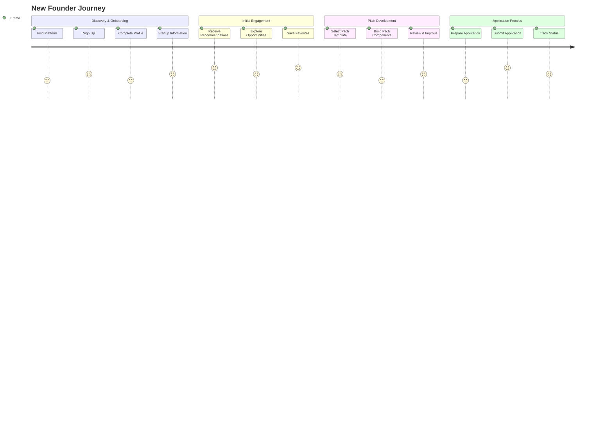
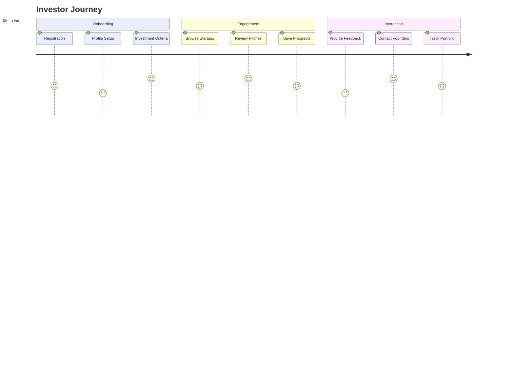

# User Experience Design

## Overview

This document outlines the user experience (UX) design approach for the Dutch Funding Opportunities platform. It details the design principles, user journeys, interface components, and interaction patterns that create an intuitive, accessible, and engaging experience for startup founders and investors navigating the Dutch funding landscape.

## UX Design Principles

### 1. Guided Journey

The platform employs a guided approach that leads users through the complex funding process with clear direction and contextual assistance.

- **Progressive Disclosure**: Information is presented in manageable chunks that gradually increase in complexity
- **Contextual Guidance**: Help and explanations appear at the moment they're needed
- **Clear Next Steps**: Users always know what actions to take next
- **Visual Progress Indicators**: Show completion status and path forward

### 2. Personalized Experience

The experience adapts to each user's specific context, preferences, and history.

- **Tailored Content**: Recommendations and information relevant to user's startup profile
- **Adaptive Interface**: UI elements that adjust based on user's goals and progress
- **Remembered Preferences**: System recalls and applies user settings across sessions
- **Contextual Settings**: Options relevant to current activity are easily accessible

### 3. Reducing Cognitive Load

The interface minimizes mental effort required to navigate and use the platform.

- **Focused Screens**: Each view has a clear purpose with minimal distractions
- **Consistent Patterns**: Similar tasks use similar interaction patterns
- **Recognition Over Recall**: Visual cues help users recognize options rather than remember them
- **Chunking Information**: Complex processes are broken into logical steps

### 4. Trust and Transparency

The design builds user confidence through honest, clear communication.

- **Clear Expectations**: Users understand what will happen at each step
- **Transparent Processes**: Matching algorithms and recommendations include explanations
- **Visible System Status**: System provides feedback about current state and operations
- **Privacy Controls**: Users understand and control their data sharing

### 5. Accessibility and Inclusivity

The platform is designed to be usable by people with diverse abilities and needs.

- **WCAG Compliance**: Adherence to Web Content Accessibility Guidelines 2.1 AA standards
- **Keyboard Navigation**: Complete functionality available without a mouse
- **Screen Reader Support**: Semantic markup and ARIA attributes for assistive technologies
- **Flexible Text Sizing**: Text scales without breaking layouts
- **Color Contrast**: Sufficient contrast ratios for text legibility

## User Personas

### Startup Founder Personas

#### Emma - Early-Stage Tech Founder


- **Background**: 28-year-old software engineer with an AI-driven product idea
- **Goals**: Find first funding, understand funding landscape, create compelling pitch
- **Pain Points**: Limited business experience, time constraints, uncertainty about eligibility
- **Technical Comfort**: High with software, lower with business applications
- **Behavioral Traits**: Detail-oriented, analytical, pressed for time

#### Noah - Growth-Stage Impact Entrepreneur


- **Background**: 35-year-old founder of a sustainability-focused startup with 2 years in operation
- **Goals**: Scale business, find aligned investors, optimize funding strategy
- **Pain Points**: Finding impact-focused investors, balancing mission with growth
- **Technical Comfort**: Moderate across platforms
- **Behavioral Traits**: Mission-driven, relationship-focused, strategic thinker

#### Sophia - International Founder New to Netherlands


- **Background**: 32-year-old entrepreneur recently relocated to Netherlands
- **Goals**: Understand Dutch funding ecosystem, build local network, navigate regulations
- **Pain Points**: Language barriers, limited local connections, unfamiliarity with Dutch funding
- **Technical Comfort**: Moderate to high
- **Behavioral Traits**: Adaptable, determined, detail-oriented with regulations

### Investor Personas

#### Martijn - Government Grant Administrator


- **Background**: 42-year-old employee at government innovation agency
- **Goals**: Find qualified applicants, reduce time on ineligible applications
- **Pain Points**: Too many unqualified applications, inefficient review process
- **Technical Comfort**: Moderate, prefers streamlined interfaces
- **Behavioral Traits**: Process-oriented, thorough, efficiency-focused

#### Lisa - Angel Investor


- **Background**: 45-year-old former tech entrepreneur, now angel investor
- **Goals**: Discover promising early-stage startups, efficiently review opportunities
- **Pain Points**: Sorting through numerous low-quality pitches, finding startups that match criteria
- **Technical Comfort**: High
- **Behavioral Traits**: Fast-paced, decisive, relationship-focused

## User Journeys

### New Founder Journey



#### Detailed Journey Map

1. **Discovery**
   - **Touchpoint**: Search engines, social media, partner referrals
   - **User Needs**: Understand what the platform offers
   - **UX Considerations**: Clear value proposition, intuitive landing page
   - **Emotions**: Curious, cautiously optimistic

2. **Registration**
   - **Touchpoint**: Sign-up form
   - **User Needs**: Quick, painless account creation
   - **UX Considerations**: Minimal required fields, social sign-up options, clear benefits
   - **Emotions**: Impatient, hopeful

3. **Profile Creation**
   - **Touchpoint**: Profile setup wizard
   - **User Needs**: Understand why information is needed, easy input
   - **UX Considerations**: Progress indicators, save & continue, contextual explanations
   - **Emotions**: Focused, sometimes uncertain about information sharing

4. **Startup Profile**
   - **Touchpoint**: Startup information forms
   - **User Needs**: Comprehensive profile without overwhelming detail
   - **UX Considerations**: Step-by-step forms, templates, examples
   - **Emotions**: Determined, occasionally frustrated with detail needed

5. **Recommendations Discovery**
   - **Touchpoint**: Dashboard, recommendation panels
   - **User Needs**: Relevant, personalized funding options
   - **UX Considerations**: Clear matching explanations, visual differentiation of opportunity types
   - **Emotions**: Excited, sometimes overwhelmed by choices

6. **Pitch Development**
   - **Touchpoint**: Pitch builder tool
   - **User Needs**: Guidance on creating compelling pitch
   - **UX Considerations**: Templates, examples, inline feedback
   - **Emotions**: Creative, sometimes anxious about quality

7. **Application Preparation**
   - **Touchpoint**: Application guidance screens
   - **User Needs**: Clear understanding of requirements and process
   - **UX Considerations**: Checklists, document templates, deadline reminders
   - **Emotions**: Methodical, occasionally stressed about deadlines

8. **Success Tracking**
   - **Touchpoint**: Progress dashboards, notification emails
   - **User Needs**: Understanding of application status and next steps
   - **UX Considerations**: Clear status indicators, contextual next actions
   - **Emotions**: Hopeful, sometimes impatient waiting for responses

### Investor Journey



## Information Architecture

### Site Map

```
Home
├── Dashboard (authenticated)
├── User Account
│   ├── Profile Settings
│   ├── Notifications
│   └── Account Settings
├── Startup Management
│   ├── My Startups
│   ├── Add Startup
│   └── Startup Details
├── Funding Opportunities
│   ├── Recommended
│   ├── Browse All
│   ├── Saved
│   └── Opportunity Details
├── Pitch Development
│   ├── My Pitches
│   ├── Create New Pitch
│   ├── Pitch Builder
│   └── Pitch Feedback
├── Application Center
│   ├── Active Applications
│   ├── Application History
│   └── Application Guidance
├── Learning Center
│   ├── Funding Guides
│   ├── Pitch Best Practices
│   └── Frequently Asked Questions
└── For Investors
    ├── Investor Dashboard
    ├── Startup Discovery
    ├── Review Pitches
    └── Provide Feedback
```

### Content Hierarchy

The platform's content is organized into a three-level hierarchy:

1. **Primary Navigation**: Core user journeys (Dashboard, Opportunities, Pitches, Applications)
2. **Secondary Navigation**: Related functions within each primary area
3. **Tertiary Content**: Specific items, details, and actions

### Wayfinding

Users are oriented through:

- **Breadcrumb Navigation**: Shows location in site hierarchy
- **Persistent Global Navigation**: Always accessible core functions
- **Contextual Navigation**: Options relevant to current content
- **Visual Location Indicators**: Active state styling in navigation
- **Progress Trackers**: Show completion status in multi-step processes

## Interaction Design

### Navigation Patterns

1. **Global Navigation**
   - Persistent top navigation bar with core sections
   - User menu for account-related functions
   - Notification center for alerts and updates

2. **Contextual Navigation**
   - Sidebar navigation within major sections
   - "Next/Previous" navigation in step-based processes
   - Related content links at appropriate decision points

3. **Search & Discovery**
   - Global search with filters and sorting
   - Categorized browsing of opportunities
   - Saved searches and favorites

### Input Methods

1. **Forms & Data Entry**
   - Progressive disclosure in complex forms
   - Inline validation with helpful error messages
   - Smart defaults based on context
   - Autosave for lengthy forms

2. **Selection & Filtering**
   - Faceted filters for refining lists
   - Drag-and-drop for priority ordering
   - Multi-select with batch actions
   - Save view/filter combinations

3. **Guided Actions**
   - Step-by-step wizards for complex processes
   - Contextual help and examples
   - Preview capabilities before submission
   - Confirmation for consequential actions

### Feedback & Affordances

1. **System Feedback**
   - Toast notifications for action confirmation
   - Progress indicators for longer operations
   - Status messages for system state
   - Error messages with recovery options

2. **Visual Affordances**
   - Consistent button styling by function
   - Hover states indicating interactivity
   - Focus indicators for accessibility
   - Disabled states for unavailable options

3. **Microinteractions**
   - Subtle animations reinforcing actions
   - Loading states that maintain context
   - Transition effects between states
   - Achievement celebrations

## Responsiveness & Device Adaptation

### Responsive Approach

The platform follows a mobile-first, responsive design approach that adapts to various screen sizes:

1. **Mobile Devices (320px-767px)**
   - Single column layouts
   - Collapsed navigation (hamburger menu)
   - Touch-optimized tap targets
   - Simplified tables and data displays

2. **Tablets (768px-1023px)**
   - Two-column layouts for appropriate content
   - Expanded navigation options
   - Sidebar navigation where appropriate
   - Optimized forms with side-by-side fields

3. **Desktop (1024px+)**
   - Multi-column layouts
   - Persistent global and contextual navigation
   - Advanced data visualization
   - Keyboard shortcuts for power users

### Adaptive Features

- **Context-Aware Components**: Elements that change presentation based on device capabilities
- **Optional Advanced Features**: Complex interactions available on desktop but simplified on mobile
- **Touch vs. Pointer Optimization**: Different interaction patterns based on input method
- **Performance Optimization**: Image sizing and feature loading based on connection speed

## UI Components and Patterns

### Core UI Components

1. **Navigation Components**
   - Global navigation bar
   - Sidebar navigation
   - Breadcrumb trails
   - Tab sets

2. **Content Display**
   - Card components (opportunity cards, pitch cards)
   - Data tables with sorting and filtering
   - Lists (simple, categorized, hierarchical)
   - Detail views and panels

3. **Input Controls**
   - Form fields (text, select, checkbox, radio)
   - Search inputs with autocomplete
   - Date pickers and range selectors
   - Sliders and toggles

4. **Feedback Components**
   - Notifications (toast, banner, modal)
   - Progress indicators
   - Status badges
   - Loading states

### UI Pattern Library

1. **Cards**
   - Opportunity Card: Displays funding opportunity with key details
   - Startup Card: Shows startup profile summary
   - Achievement Card: Visualizes earned achievements
   - Progress Card: Shows completion status for a process

2. **Forms**
   - Step-by-step form: Multi-page form with progress tracking
   - Inline form: Compact form for quick edits
   - Search form: Advanced search with filters
   - Feedback form: Structured feedback collection

3. **Data Visualization**
   - Match score indicator: Visual representation of compatibility
   - Progress chart: Shows completion across categories
   - Timeline: Visual representation of deadlines and milestones
   - Comparison view: Side-by-side evaluation of options

4. **Navigation Patterns**
   - Wizard navigation: Guided step-by-step process
   - Hub and spoke: Central dashboard with specialized tools
   - Filter navigation: Content discovery through progressive filtering
   - Favorites and recents: Quick access to frequent items

## Visual Design System

### Color Palette

1. **Primary Colors**
   - Primary Blue (#0062FF): Main actions, key UI elements
   - Secondary Orange (#FF6B00): Accents, secondary actions
   - Tertiary Green (#00B878): Success states, positive indicators

2. **Neutral Colors**
   - Dark Grey (#212529): Primary text
   - Medium Grey (#6C757D): Secondary text, borders
   - Light Grey (#E9ECEF): Backgrounds, disabled states
   - White (#FFFFFF): Card backgrounds, primary content areas

3. **Semantic Colors**
   - Success Green (#28A745): Positive outcomes, completions
   - Warning Yellow (#FFC107): Alerts, approaching deadlines
   - Error Red (#DC3545): Errors, destructive actions
   - Info Blue (#17A2B8): Informational messages

### Typography

1. **Font Families**
   - Primary: Inter (sans-serif)
   - Secondary: Georgia (serif) for longer content
   - Monospace: Roboto Mono for code and technical content

2. **Type Scale**
   - Display (32px/2rem+): Major headings, hero text
   - Heading (18-30px/1.125-1.875rem): Section headers
   - Body (16px/1rem): Primary content text
   - Small (14px/0.875rem): Secondary information, captions
   - Micro (12px/0.75rem): Legal text, footnotes

3. **Type Styles**
   - Light: 300 weight
   - Regular: 400 weight
   - Medium: 500 weight
   - Bold: 700 weight
   - Line height: 1.5 for body text, 1.2 for headings

### Iconography

1. **Icon System**
   - Outline style for navigation and common actions
   - Solid style for status indicators and alerts
   - Consistent 24px sizing with 2px stroke

2. **Icon Categories**
   - Navigation icons: Home, search, user, settings
   - Action icons: Add, edit, delete, save
   - Status icons: Success, warning, error, info
   - Domain-specific icons: Funding, pitch, application

### Spacing System

1. **Base Unit**
   - 4px base unit for all spacing

2. **Spacing Scale**
   - Micro (4px): Minimal separation
   - Tiny (8px): Tight grouping
   - Small (12px): Related elements
   - Medium (16px): Standard separation
   - Large (24px): Component spacing
   - XL (32px): Section spacing
   - XXL (48px): Major section divisions

3. **Consistent Application**
   - Padding: Internal spacing within components
   - Margin: External spacing between components
   - Grid gutters: Consistent horizontal spacing

## Accessibility Approach

### Standards Compliance

- **WCAG 2.1 AA**: Compliance with Web Content Accessibility Guidelines
- **Semantic HTML**: Proper use of HTML elements according to their meaning
- **ARIA attributes**: When needed to enhance accessibility
- **Keyboard navigation**: Complete functionality without mouse

### Inclusive Design Practices

1. **Visual Accessibility**
   - Sufficient color contrast (minimum 4.5:1 for normal text)
   - Text resizing without loss of functionality
   - Non-color dependent information
   - Focus indicators for keyboard navigation

2. **Auditory Accessibility**
   - Text alternatives for audio content
   - Captions for video content
   - No audio-only feedback

3. **Motor Accessibility**
   - Large enough touch targets (minimum 44x44px)
   - Adequate spacing between interactive elements
   - Reduced motion option for animations
   - Time-insensitive interactions

4. **Cognitive Accessibility**
   - Clear, simple language
   - Consistent layout and navigation
   - Error prevention and recovery
   - Multiple ways to access content

### Accessibility Testing

- **Automated testing**: Regular checks with accessibility evaluation tools
- **Screen reader testing**: Verification with NVDA, JAWS, and VoiceOver
- **Keyboard-only testing**: Ensuring all functionality works without a mouse
- **User testing**: Sessions with users who have disabilities

## Gamification Design

### Engagement Framework

The platform incorporates gamification elements to enhance engagement while maintaining professionalism:

1. **Progress Tracking**
   - Visual completion indicators for profiles and pitches
   - Milestone celebrations at key completion points
   - Progress history visualization

2. **Achievement System**
   - Badges for completing important actions
   - Recognition for funding milestones
   - Skill development acknowledgments

3. **Guided Mastery**
   - Progressive challenges that build competence
   - Contextual tips and learning opportunities
   - Personalized next-step recommendations

### Gamification Elements

1. **Visual Progress**
   - Progress bars for multi-step processes
   - Checklists for task completion
   - Startup journey map with current position

2. **Achievement Badges**
   - Profile Completer: Fully completed profile
   - Pitch Master: Completed all pitch components
   - Funding Pioneer: First application submitted
   - Network Builder: Connected with multiple investors

3. **Milestone Celebrations**
   - Subtle animations for completions
   - Congratulatory messages at key points
   - Achievement showcases on dashboard

4. **Learning Integration**
   - Knowledge unlocks at relevant journey points
   - "Did you know?" contextual learning moments
   - Skill level indicators for different platform areas

## User Research and Testing

### Research Methods

1. **User Interviews**
   - In-depth interviews with startup founders
   - Structured interviews with investors
   - Contextual inquiry in natural environments

2. **Usability Testing**
   - Task-based usability sessions
   - Remote and in-person testing
   - Prototype evaluation at various fidelities

3. **Quantitative Research**
   - Surveys of target user groups
   - Analytics review of existing platforms
   - A/B testing of design variations

### Testing Focus Areas

1. **Navigation Testing**
   - Wayfinding effectiveness
   - Information architecture validation
   - Navigation pattern comprehension

2. **Form and Input Testing**
   - Form completion rates
   - Error recovery strategies
   - Input method appropriateness

3. **Content Comprehension**
   - Understanding of funding terminology
   - Clarity of instructions
   - Effectiveness of educational content

4. **Mobile Responsiveness**
   - Usability across device sizes
   - Touch interaction effectiveness
   - Content prioritization on small screens

### Iterative Design Process

1. **Research Insights**
   - User pain points and needs identification
   - Behavior pattern recognition
   - Mental model documentation

2. **Design Hypotheses**
   - Potential solutions based on research
   - Priority identification for implementation
   - Expected outcomes and metrics

3. **Prototype and Test**
   - Rapid prototyping of solutions
   - User testing with target audience
   - Metrics collection against benchmarks

4. **Refinement**
   - Design adjustments based on feedback
   - Iterative improvement cycles
   - Documentation of learning

## Implementation Guidelines

### Design-to-Development Handoff

1. **Component Documentation**
   - Detailed specifications for each component
   - State variations and behaviors
   - Accessibility requirements

2. **Asset Delivery**
   - Icons in multiple formats (SVG preferred)
   - Image optimization guidelines
   - Animation specifications

3. **Responsive Specifications**
   - Breakpoint definitions
   - Component behavior across screen sizes
   - Prioritization for mobile views

### Quality Assurance

1. **Design QA Checklist**
   - Visual consistency review
   - Interaction pattern consistency
   - Accessibility compliance checks
   - Responsive behavior verification

2. **Design-Development Collaboration**
   - Regular review sessions
   - Design system maintenance
   - Pattern library updates

3. **User Testing Validation**
   - Post-implementation usability testing
   - Comparison to design intent
   - Identification of implementation gaps

## Conclusion

The UX design for the Dutch Funding Opportunities platform creates a guided, personalized experience that simplifies the complex funding landscape for startup founders while providing efficient tools for investors. By following a user-centered approach focused on reducing cognitive load, building trust, and ensuring accessibility, the platform aims to increase funding success rates and improve the overall Dutch startup ecosystem.

The design system provides a consistent, scalable foundation that balances professionalism with engagement, using subtle gamification to motivate users through their funding journey while maintaining the serious nature of the financial processes involved.

As the platform evolves, continuous user research and iterative design will ensure that it remains responsive to user needs and market changes, with regular updates to the design system and UX patterns based on performance data and feedback. 